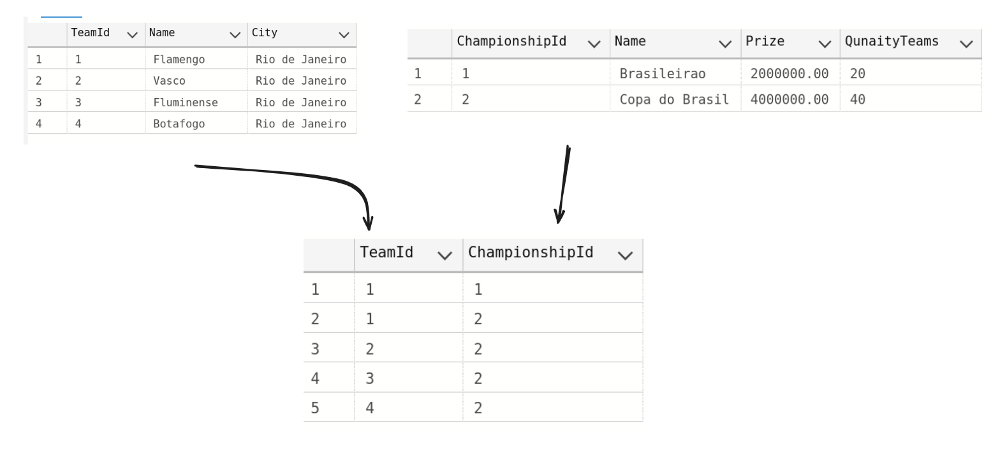

# Futzinho
Estou criando um API de um jogo de futbol

FluentAssertions:
A utilização e para fazer os relacionamento entre as tabelas.

Design:
Seu uso é para a criação das minha migrations.

SqlServer:
Onde vou fazer minha a conexão.

## Tabelas

##### Tenho 3 tabelas de `Championship`, `Team` e `TeamChampionshipLink`
`Championship` é minha tabela de campeonatos com as seguintes funcionalidade:

  * `GET` onde podemos visualizar todos os campeonatos ou apenas um por seu ID.
  * `PUT` onde podemos está criando os nossos campeonatos.
  * `POST` onde podemos ta alterando nossos campeonatos com base no ID.
  * `DELETE` onde deletamos nosso campeonato com base no ID.

o mesmo se repete para as outras tabelas !

## Relacionamento de Tableas

